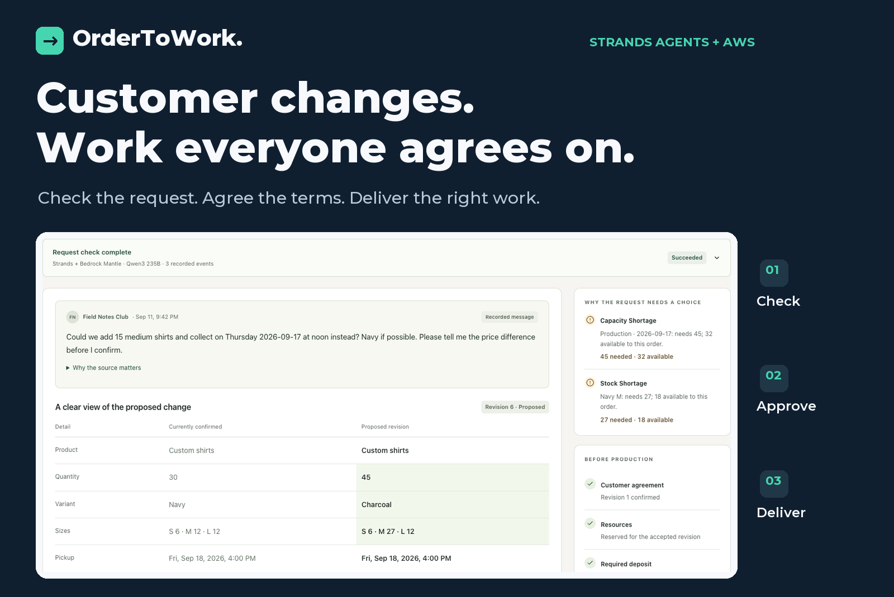
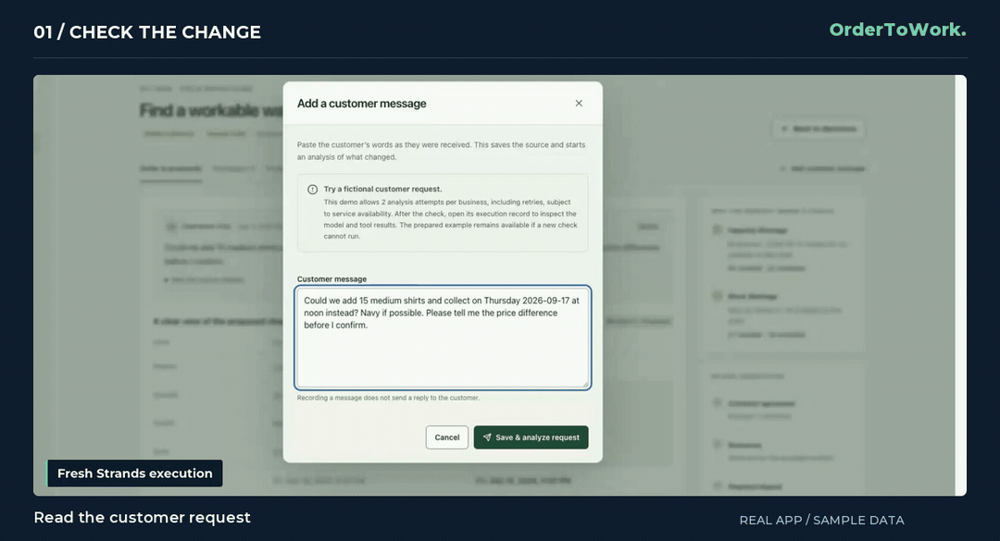
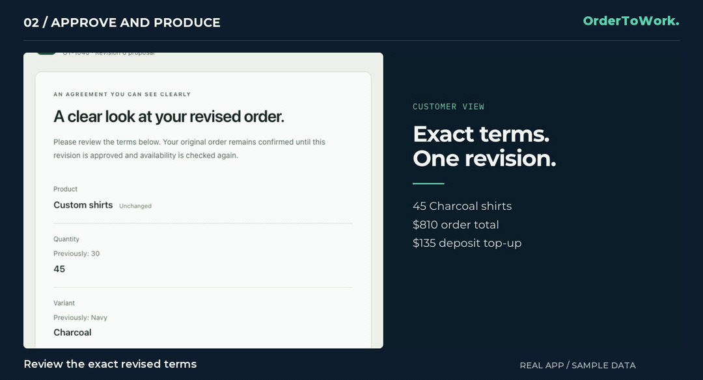
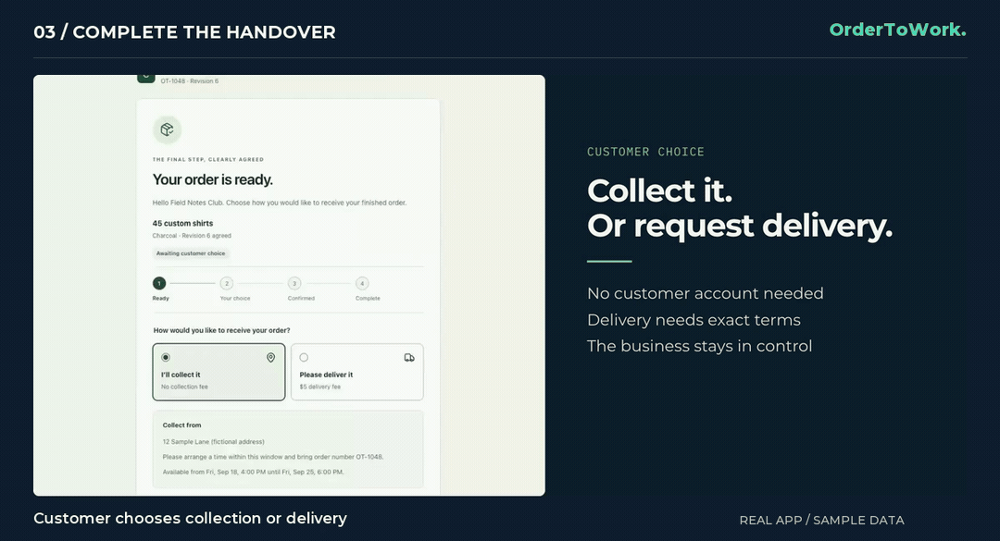
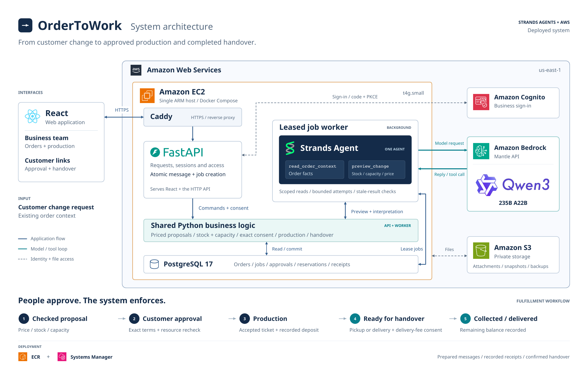

<p align="center">
  <a href="https://34-230-185-63.sslip.io">
    
  </a>
</p>

<p align="center">
  <a href="https://34-230-185-63.sslip.io"></a>
  <a href="#walkthrough"></a>
  <a href="#run-locally"></a>
</p>

<p align="center">
  <a href="https://github.com/strands-agents/sdk-python">Strands Agents</a> ·
  <a href="https://aws.amazon.com/bedrock/">Amazon Bedrock</a> ·
  Qwen3 · React · FastAPI · PostgreSQL ·
  <a href="LICENSE">MIT licensed</a>
</p>

# OrderToWork

An AI workbench for made-to-order businesses. A customer's “can we add fifteen more and collect earlier?” becomes a checked proposal, an exact agreement, and work the team can deliver.

The existing agreement stays intact while alternatives are explored. **People approve the change. Application rules protect the commitment.** Merchandise and bakery profiles share the workflow, with their own specifications, prices, stock, and production capacity.

**[Open the live demo →](https://34-230-185-63.sslip.io)** No sign-up required. Choose **Try the live demo** for temporary sample workspaces. Saved examples open without inference; **Add customer message** runs the real Strands agent on Amazon Bedrock. Use fictional data in the demo.

[Walkthrough](#walkthrough) · [Architecture](#architecture) · [Run locally](#run-locally) · [Deploy on AWS](#deploy-on-aws) · [Documentation](#documentation)

## One agreement, all the way through

| Customer change | Checked proposal | Exact approval | Production | Handover |
| :--- | :--- | :--- | :--- | :--- |
| Keep the message and source evidence. | Check price, stock, and dated capacity. | Bind consent to one revision and its terms. | Release the accepted ticket when checks pass. | Agree collection or delivery and record completion. |

## Walkthrough

These silent GIFs show the working application with synthetic orders and receipts. Excerpts omit waiting and navigation; they do not represent continuous processing speed. [Still images and step-by-step instructions →](docs/walkthrough.md)

### 01 / Find a workable change

The request exceeds navy stock and the earlier production slot. A real Strands run reads order context and checks feasibility. The owner can offer **45 charcoal shirts at the original pickup for $810**, with a **$135 deposit top-up**.

<picture>
  <source media="(prefers-reduced-motion: reduce)" srcset="docs/media/01-check-the-change.png">
  
</picture>

Each option is checked against application rules. A suggestion does not replace the customer's accepted order.

### 02 / Make what the customer approved

The customer reviews the exact specifications, price, pickup, and deposit through a private link. Approval rechecks availability and replaces reservations atomically. The recorded deposit and production checks then control release of the accepted ticket.

<picture>
  <source media="(prefers-reduced-motion: reduce)" srcset="docs/media/02-approve-and-produce.png">
  
</picture>

The owner, customer, and operator work from the same accepted revision. An agent cannot approve an order, record a receipt, or start production.

### 03 / Finish with a clear handover

A customer link offers collection or a delivery request. Delivery needs acceptance of the exact address, fee, and terms. The business records the remaining payment and marks collection or delivery complete.

<picture>
  <source media="(prefers-reduced-motion: reduce)" srcset="docs/media/03-complete-the-handover.png">
  
</picture>

The agreement continues beyond production. Handover uses application rules and requires no additional model call.

<details>
<summary><strong>Same workflow, a second business: Butter &amp; Crumb bakery</strong></summary>

The bakery profile uses cupcake specifications and batch capacity measured in minutes. It shares the same proposal, consent, production, and handover rules. This is a prepared sample; additional industries still need validation with real businesses.


</details>

## Architecture

One Strands agent connects language to current business facts. Shared Python services own authoritative prices, reservations, exact consent, and production and handover transitions.

[](docs/media/architecture.pdf)

[Full-size diagram](docs/media/architecture.png) · [Download PDF](docs/media/architecture.pdf) · [Technical design](docs/architecture.md)

| Layer | Built with | Responsibility |
| --- | --- | --- |
| Interfaces | React · TypeScript | Owner decisions, operator tickets, customer consent |
| API and domain | FastAPI · SQLAlchemy | Access, calculations, transactional commitments |
| Analysis | Leased worker · Strands Agents | Interpretation, source evidence, scoped tools |
| Model | Qwen3 235B A22B · Bedrock Mantle | Interpret customer language using order context |
| Data and identity | PostgreSQL 17 · S3 · Cognito | Orders/jobs, private files/snapshots, business sign-in |
| Hosting | ARM EC2 · Docker Compose · Caddy | API, worker, database, and HTTPS on one host |

<details>
<summary><strong>What makes the agent execution reliable?</strong></summary>

- **Scoped tools:** `read_order_context` supplies order facts; `preview_change` checks pricing, stock, and capacity. Neither commits a business action.
- **Durable jobs:** a message and its analysis job commit together. The worker must still own the lease and current revision before saving results.
- **Exact commitments:** approval locks rows, rechecks availability, and swaps reservations in one transaction. Stale consent cannot overwrite newer terms.
- **Visible evidence:** records show the actual model, tool activity, source quotes, and reported usage. Failed inference remains a failed analysis.
- **Bounded inference:** attempts, turns, and output are limited. A failed live run is never silently replaced with reference-mode output.

Strands' OpenAI-compatible adapter targets **AWS Bedrock Mantle** using scoped IAM credentials and short-lived tokens. No OpenAI service account is required. [Provider setup →](deploy/mantle-README.md)

</details>

## Run locally

Requires **Python 3.12**, [uv](https://docs.astral.sh/uv/), **Node.js 22+**, and a running **Docker** engine.

```sh
git clone https://github.com/sudo-anshul/ordertowork.git
cd ordertowork
python3 scripts/dev.py
```

Open **http://localhost:5173**, use a test identity, and create a workspace with sample data. The launcher installs dependencies, starts PostgreSQL, applies migrations, and runs the API, worker, and frontend.

The default **reference mode is a limited deterministic interpreter, not live AI**. It supports local exploration without AWS credentials. Development sign-in is loopback-only and is not verified identity; use test information. Live inference requires your own AWS credentials and model access.

[Detailed setup, separate terminals, ports, and checks →](docs/development.md)

## Deploy on AWS

The live deployment uses `OTW_AGENT_MODE=bedrock`, `OTW_BEDROCK_ENDPOINT=mantle`, and `OTW_BEDROCK_MODEL_ID=qwen.qwen3-235b-a22b-2507`.

Follow the [single-host guide](deploy/budget-README.md), [Cognito/S3 setup](docs/aws-services.md), and [Mantle permissions](deploy/mantle-README.md). One production image runs the API and worker separately. Paid-attempt limits reduce exposure but are not a dollar spending cap; `OTW_MAX_DAILY_BEDROCK_ATTEMPTS=0` pauses paid inference.

## Scope and validation

The app includes owner/operator permissions, workspace memberships, private attachments, immutable proposals, holds, recorded receipts, and complete handover. Automated checks cover consent, concurrency, stale revisions, job leases, deposits, role boundaries, and handover. CI checks the backend against PostgreSQL, builds the frontend, and builds the production container. [CI runs](https://github.com/sudo-anshul/ordertowork/actions/workflows/ci.yml) · [Validation notes](docs/validation.md)

Receipts record money received elsewhere. Notifications are prepared for manual sharing. Delivery statuses are business records. Payment processing, automatic messaging, courier tracking/booking, and document interpretation are outside this release. Real-world adoption, time savings, and error reduction have not yet been measured.

## Documentation

| Start here | Go deeper |
| --- | --- |
| [Product walkthrough](docs/walkthrough.md) | [Architecture and consistency](docs/architecture.md) |
| [Local development and checks](docs/development.md) | [HTTP API contract](docs/api-contract.md) |
| [Ready for handover](docs/handover.md) | [Development conventions](docs/implementation-contract.md) |
| [Live demo configuration](docs/judge-demo.md) | [AWS deployment runbook](deploy/README.md) |
| [Hosted model verification](docs/live-mantle-checks.md) | [Cognito and storage verification](docs/live-aws-checks.md) |

Built by [Anshul](https://github.com/sudo-anshul) for Agents for Humans. [MIT license](LICENSE). Third-party marks identify the components used; see [media credits](docs/media/README.md).
