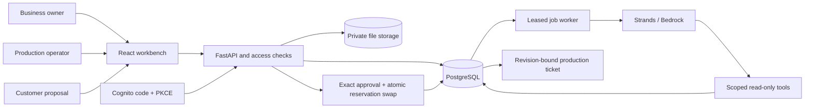

# Architecture

In development, explicit loopback-only identity and local file storage make the product runnable without AWS. The deterministic reference interpreter is clearly labeled; it is not an AI model. The same HTTP routes and transactional domain services are used in both modes. Production configuration requires Cognito, HTTPS and private S3 storage; Bedrock requires an explicit accessible model identifier and AWS credentials.

## Reliable changes

An accepted order remains authoritative while alternatives are considered. Each proposal freezes its terms, resource requirements, base accepted revision and content hash. Sharing creates a scoped expiring approval token. Customer consent checks that exact revision and hash; the server locks the order and sorted resource rows, checks current availability, and swaps reservations in one transaction. Concurrent approval attempts cannot commit the same last resources. Duplicate approval is idempotent. A failed replacement preserves the prior terms and holds.

Payment recording is a separate audited owner action, not payment processing. Production release requires current customer approval, committed resources, enough recorded deposit and no hold. Started work consumes its reservations and cannot be silently rewritten by an agent.

## Durable analysis

Messages and jobs commit together. Workers claim jobs with PostgreSQL row locks, lease tokens and order serialization. Inference runs outside database transactions. Before persisting results, the worker verifies its lease and the order's revision head. Expired work cannot overwrite a newer result. Failures remain visible and manual retry is bounded. Strands tools read only the current authorized order and authoritative pricing/availability; they cannot accept terms or record money.

## Access and files

Opaque HttpOnly sessions contain no business authority themselves; server-side memberships determine access. Cookie mutations require CSRF validation. Cognito callbacks bind state/nonce/PKCE and validate the token signature, issuer, audience and verified email. Customer capability links are independent of the owner session and do not establish verified named identity.

Attachments are privately stored under generated immutable object keys, bounded by size/type, and downloaded after owner authorization. PDF/PNG/JPEG support does not imply malware scanning or AI extraction. Production operations receive a deliberately limited view. PostgreSQL row-level security is not currently enabled; tenant isolation is enforced in application queries and tested across endpoints.

## Current boundaries

AWS provider configuration and deployment are prepared but have not been exercised against a live account. External email/WhatsApp delivery, payment capture/refunds, ingredient-level recipe planning, general-purpose profile builders and automated data erasure are outside this release. Sources, test modes and manual actions stay explicit in the interface.
