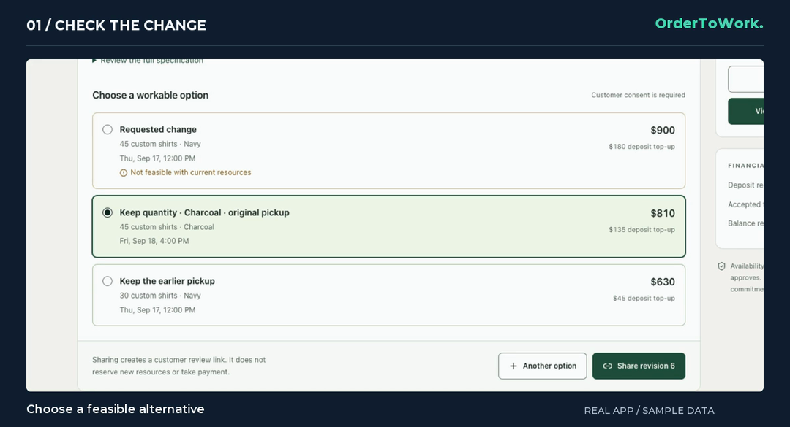
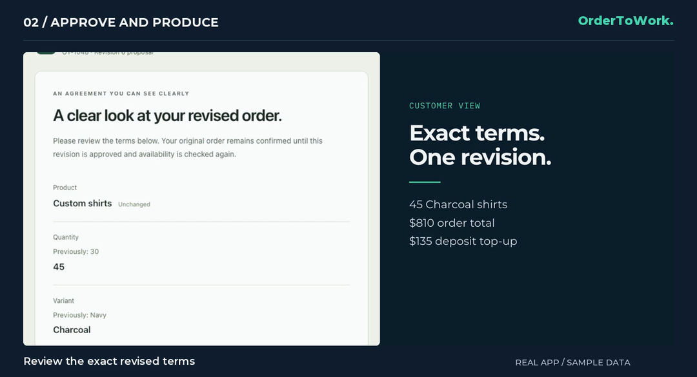
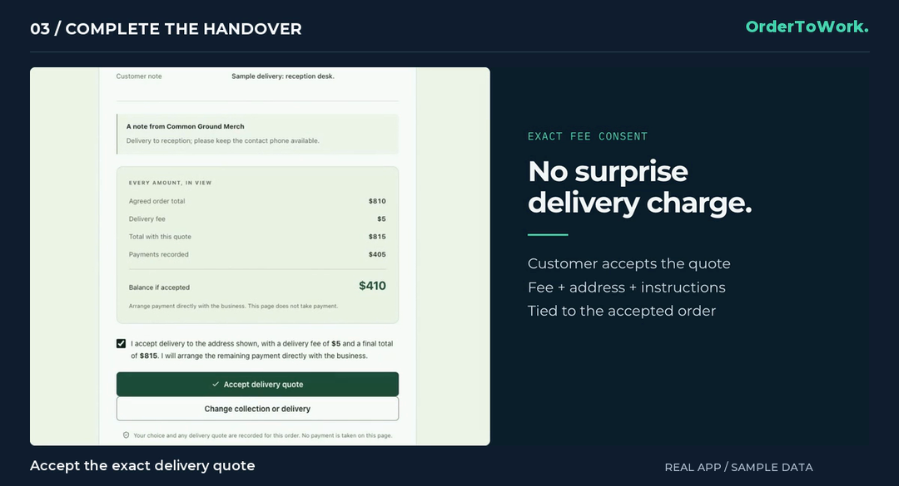
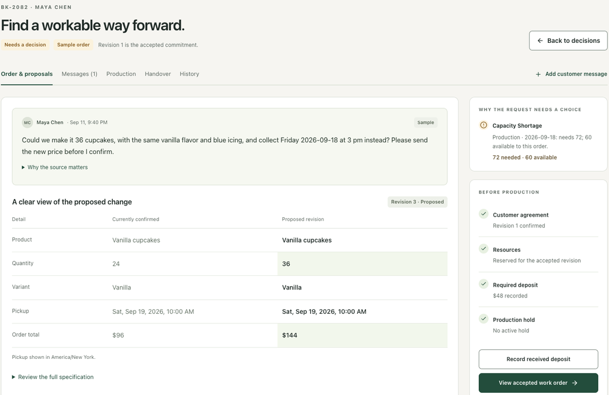

# Try the complete workflow

[Open OrderToWork](https://34-230-185-63.sslip.io) and choose **Try the live demo**. It opens a temporary sample order without sign-up. For local development, create a merchandise workspace with sample data after [starting the app](development.md).

Use fictional customer information and receipts. The default local reference interpreter is deterministic; the hosted live-analysis action uses the configured Strands/Bedrock provider. Opening a saved example does not run a model.

## 1. Inspect the customer change

Open **OT-1048 / Field Notes Club**. Its accepted baseline is 30 navy shirts for $540, with $270 already recorded. The customer asks to add 15 medium shirts and collect earlier. Navy stock and the earlier production slot prevent that combination.

To exercise the live agent, select **Add customer message**, enter a fictional request, and wait for the saved result. The demo's public inference allowance is bounded. Expand **Request check complete** to inspect the actual model, tool activity, source evidence, and reported usage.

## 2. Offer a feasible alternative

Choose 45 charcoal shirts at the original pickup. The proposed total is $810, with a $135 deposit top-up. Review the specifications and price, then share the proposal. Sharing creates a private customer review link; it does not reserve proposed resources or replace the existing agreement.

## 3. Approve as the customer

Open the customer link, review the terms, check explicit consent, and approve. The server rechecks availability before committing the new reservation and accepted revision. Revision numbers vary with the number of proposals prepared; the recording shows revision 6.

## 4. Release production

Return to the business workbench. Production remains blocked until the required deposit is recorded. For this synthetic example, record the $135 top-up with an obvious test reference. The deposit total becomes $405, leaving $405 outstanding.

Open the accepted production ticket and start work. Approval, committed resources, deposit, and hold checks must all pass. Started work cannot be silently replaced by a new agent proposal.

## 5. Prepare handover

When the work is finished, open **Handover**. Prepare a fictional collection address, collection window, and delivery policy. Create a private customer link and copy the notification text for manual sharing. The application does not send the message.

## 6. Agree collection or delivery

On the customer link, either choose collection within the offered window or request delivery with fictional contact details. The business checks the address and prepares the fee. Return to the customer link and accept the exact quote.

In the recorded example, the $5 fee changes the total from $810 to $815, leaving $410 outstanding after the $405 deposit. This is a delivery agreement, not a courier booking.

## 7. Record completion

Record the remaining sample balance with another fictional reference. Mark the order **Collected**, or **Out for delivery** followed by **Delivered**. The completed handover stays connected to the accepted order and recorded receipts in history.

## 8. Try the bakery profile

Switch to the sample bakery workspace to inspect the same workflow with cupcake specifications and batch capacity measured in minutes. This illustration is a prepared example, not a new live analysis.

The public demo session is temporary and cannot reset started work. Use a fresh sample workspace when testing locally. [Demo access and limits](judge-demo.md) explain hosted access; [handover](handover.md) documents collection and delivery rules.

[Back to the project](../README.md)
